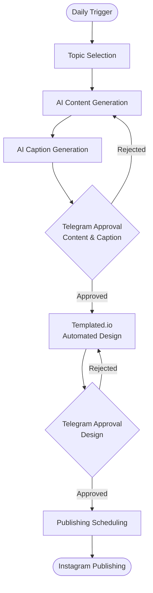

# AI-Powered Social Media Content Automation

An end-to-end AI automation system built with **n8n, LLMs, Telegram, Templated.io, and Instagram**.

## Overview

This project automates the complete social media content creation and publishing pipeline, from topic selection and AI-powered research to content generation, visual design, human approval, scheduling, and Instagram publishing.

The system uses multiple interconnected n8n workflows to orchestrate the process while keeping a **Human-in-the-Loop** approval step before publishing.

## Tech Stack

- **n8n** — Workflow orchestration and automation
- **LLMs / OpenAI API** — AI-powered research and content generation
- **Telegram Bot API** — Human approval and workflow control
- **Templated.io** — Automated visual content generation
- **Instagram Graph API** — Automated publishing
- **Webhooks** — Event-driven workflow communication
- **HTTP APIs** — External service integrations

## Workflow Architecture

The automation is divided into several interconnected workflows:

### 1. Daily Topic & Research

- Selects a new topic
- Passes the information to the content generation stage

### 2. Content & Caption Generation

- Generates social media content using LLMs
- Creates captions and supporting text
- Structures the output for downstream automation

### 3. Telegram Approval

- Sends the generated content for human review
- Provides an approval checkpoint before publishing
- Routes approved content to the next stage of the workflow

### 4. Visual Content Generation

- Sends structured content to Templated.io
- Automatically generates the required visual assets
- Passes the generated assets to the publishing workflow

### 5. Telegram Approval

- Allows the user to approve the design or request changes
- Continues to the publishing workflow only after design approval

### 6. Instagram Scheduling And Publishing

- Processes the approved content and visual assets
- Prepares the final Instagram post
- Schedules or publishes the content through the Instagram Graph API

## Key Features

- End-to-end AI-powered content automation
- Multi-workflow orchestration using n8n
- Human-in-the-Loop approval
- LLM-based research and content generation
- Automated caption generation
- Automated visual content generation
- API integrations across multiple services
- Automated Instagram publishing
- Reduced repetitive manual work
- Modular and extensible workflow architecture

## Project Impact

The workflow reduced the social media post preparation process from **3+ hours of manual work to seconds** once the required approval is provided.

The automation replaces a repetitive multi-step process with an integrated pipeline:

## 🔄 Automation Workflow

