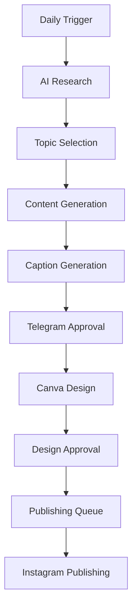

# AI Minute — 1-Page Technical Specification

**Project Type:** AI Content Automation System  
**Platform:** Instagram Carousel Content Generation  
**Automation Engine:** n8n  

---

# 1. Project Overview

AI Minute is an AI-powered content automation system that automates the end-to-end creation of educational Instagram carousel posts about Artificial Intelligence.

The system discovers trending AI topics, generates beginner-friendly educational content, creates branded carousel designs, and schedules publishing while maintaining a human approval step before any content goes live.

---

# 2. Problem

Creating educational AI content manually requires continuous:

- Research
- Content writing
- Design creation
- Caption writing
- Publishing scheduling

This process is slow, repetitive, and difficult to scale.

---

# 3. Solution

The system automates the content creation workflow using AI agents and workflow automation.

It:

- Researches trending AI topics
- Validates topics against previous content
- Generates educational carousel slides
- Creates engaging captions
- Generates branded Canva designs
- Publishes approved posts automatically to Instagram

---

# 4. High-Level Workflow

---

# 5. Core Components

| Component | Responsibility |
|-----------|----------------|
| AI Research | Discover trending AI topics from trusted sources |
| Topic Selection | Select educational and non-duplicate topics |
| Content Memory | Track previously published topics using Airtable |
| Content Generator | Generate a 5-slide educational Instagram carousel |
| Caption Generator | Create engaging Instagram captions with CTA |
| Approval System | Enable manual approval through Telegram |
| Canva Automation | Generate branded carousel designs automatically |
| Publishing Queue | Schedule and publish approved posts to Instagram |

---

# 6. Technology Stack

| Layer | Technology |
|-------|------------|
| Workflow Automation | n8n |
| AI Models | GPT / Gemini |
| Research | Web Search APIs + RSS Feeds |
| Database | Airtable |
| Communication | Telegram Bot API |
| Design | Canva API |
| Publishing | Instagram Graph API |

---

# 7. MVP Scope

## Included

✅ AI topic discovery  
✅ Trend analysis  
✅ Carousel content generation  
✅ Caption generation  
✅ Telegram approval workflow  
✅ Canva automation  
✅ Instagram scheduling and publishing  

---

## Future Enhancements

- Multi-platform publishing
- AI-generated videos
- Analytics dashboard
- Personalized content strategy
- Semantic memory using vector databases

---

# 8. Success Metrics

The project success will be measured by:

- Reduced manual content creation time
- High approval rate for generated content
- Reliable automated publishing
- Diverse and non-duplicated AI topics
- Consistent educational content quality
